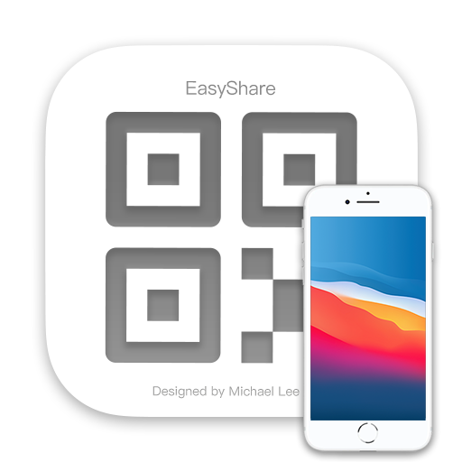
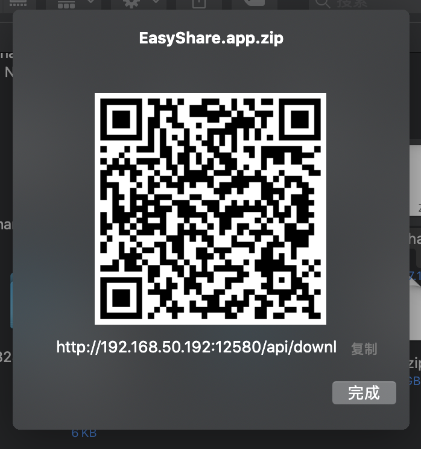
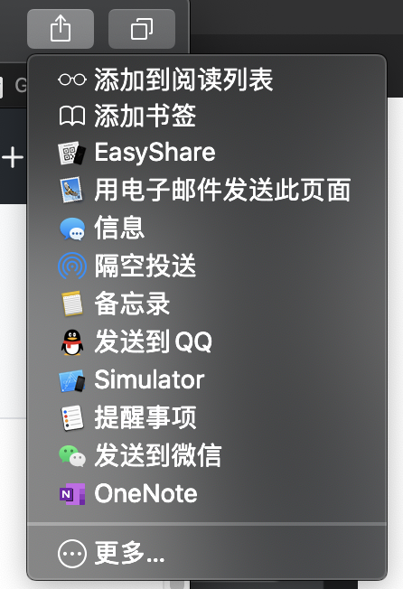

# EasyShare   [简体中文](README_zh.md)
Easy Share File From Mac To Every Devices

 

## Install

Download the release package and unzip it, copy EasyShare.app into Applications dir. This app is just some tips.

Open System Preferences -> Extensions -> Share Menu, and select EasyShare.

## Use

Open the finder, select the file you want to share, right-click, then select share -> EasyShare, you will see a QRCode on your screen, like this.

Your devcies should been connected to the same Wi-Fi.

Then, you can copy the url and open it in your browser to download. But, the most convenient way is use your smartphone to scan this QRCode.

Do not click the `完成` button before the download is completed, otherwise the link will be disconnected.

That's all, everything is so easy!

## For Pro Man

The default http port is 12580, if you want to change it, you can search `EasyShare.sqlite` and change something.

## Something New

I found masOS's `ShareExtension` can used in Safari and other browers. So you can share web page by `EasyShare` now. Just click right-top button in Safari, and select `EasyShare`, you will get a QRCode, then you can scan to visit this web page in your smartphone. Like this.

But I don't kown how to get the web page's title, and Apple provide no document. So, let it be. haha :)

## One More Thing

There is a way to send a file from Android to Mac, [Check here for download `AndDrop`](https://play.google.com/store/apps/details?id=com.neure.anddrop).
