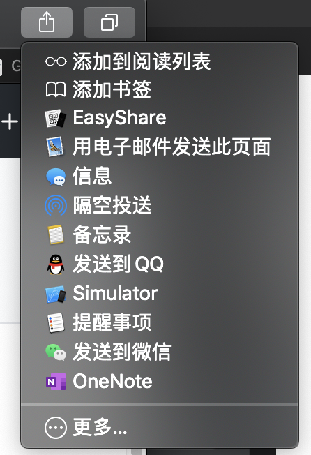

# EasyShare
非常简单的从你的Mac分享文件到任何设备

## 安装

下载release里面的文件，并且解压，把EaseShare.app拖进应用目录。这个app打开之后只有一些提示。

打开 系统偏好设置 -> 拓展 -> 共享菜单，并且勾选EasyShare。

## 使用

打开访达，选中你想要分享的文件，右键并选择共享->EasyShare，你就能得到一个像这样的二维码。

保证你的设备都处于同一个网络下。

现在你可以在另一个设备的浏览器打开这个url进行下载了。当然，更方便的办法是，直接拿出手机扫码进浏览器。不要用微信。

在下载完成之前不要点`完成`按钮，否则会断开链接。

完事儿，就这么简单。

## 一些新东西

我发现可以在Safari和其他的浏览器里面使用macOS的`ShareExtension`，所以，现在可以使用`EasyShare`来生成二维码，使用手机扫码就可以访问这个网页了。只需要点击Safari右上角的按钮，在选择`EasyShare`就可以了。像这样。

但是我实在不知道怎么获取网页的标题, 并且苹果也没有提供文档。所以就这样吧。 😂
